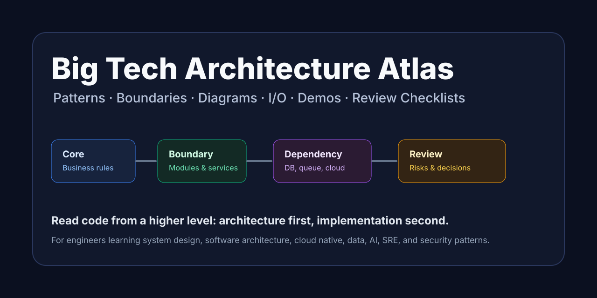

# Big Tech Architecture Atlas

> A practical architecture learning atlas for engineers: big-tech architecture patterns, boundaries, diagrams, sequence flows, standard I/O, and minimal GitHub demos.



中文名建议：**大厂架构图谱**  
推荐 GitHub 仓库名：`big-tech-architecture-atlas`  
推荐仓库描述：`A practical atlas of big-tech architecture patterns with diagrams, sequence flows, I/O contracts, boundaries, dependencies, and minimal GitHub demos.`

## English Summary

**Big Tech Architecture Atlas** helps engineers understand modern software architecture from a higher level:

- what each architecture pattern is for,
- what belongs to the architecture core,
- what is only a dependency or supporting capability,
- how requests, events, data, and model calls flow through the system,
- what standard inputs and outputs each architecture boundary should expose,
- what anti-patterns to avoid,
- and which minimal GitHub demos are worth reading.

It is designed for engineers who want to read unfamiliar codebases, understand system design decisions, and build architecture judgment beyond framework-level knowledge.

## Why This Exists

很多架构资料容易停留在概念层：知道名字，但看代码时还是不知道系统为什么这样拆。

这套资料的目标是帮你建立更高层级的阅读能力：

- 看一个项目时，先判断它属于哪类 Architecture。
- 看一段代码时，知道它处在 Core、Boundary、Dependency 还是 Supporting Capability。
- 看一个调用链时，能画出组件图、时序图和输入输出。
- 看一个 GitHub Demo 时，不只是跑起来，而是看懂它的架构意图。

## Repository Keywords

`software-architecture`, `system-design`, `big-tech`, `architecture-diagrams`, `sequence-diagrams`, `microservices`, `ddd`, `clean-architecture`, `hexagonal-architecture`, `cloud-native`, `kubernetes`, `event-driven-architecture`, `cqrs`, `saga`, `rag`, `llmops`, `mlops`, `platform-engineering`, `sre`, `zero-trust`

## What Is Included

| Document | Purpose |
|---|---|
| [Architecture Map](architecture-map.md) | 总览图：用 Mermaid 展示学习路径、架构分类和阅读方法 |
| [Big Tech Architecture Report](big-tech-architecture-report.md) | 全景报告：大厂常用架构、存在意义、解决痛点和适用需求 |
| [Architecture Selection Matrix](architecture-selection-matrix.md) | 选择矩阵：根据团队、业务、数据、一致性、AI 场景选择架构 |
| [Architecture Maturity Model](architecture-maturity-model.md) | 成熟度模型：标记学习难度、生产常见度、适用阶段和风险 |
| [Architecture Boundaries and Dependencies](architecture-boundaries-and-dependencies.md) | 边界报告：区分每个架构的 Core、Boundary、Dependency 和 Supporting Capability |
| [Architecture Diagrams, Sequence Diagrams and I/O](architecture-diagrams-and-io.md) | 图解报告：每个架构的 Mermaid 架构图、时序图和标准输入输出 |
| [Architecture Minimal GitHub Demos](architecture-minimal-github-demos.md) | Demo 导航：每个架构对应一个最小 GitHub Demo，并链接到对应图解 |
| [Architecture Anti-Patterns](architecture-anti-patterns.md) | 反模式清单：识别常见架构误区和修正方向 |
| [Architecture Review Checklist](architecture-review-checklist.md) | 评审清单：读代码、审项目、分析架构时可以直接套用 |
| [30-Day Architecture Learning Path](architecture-learning-path-30-days.md) | 学习路线：30 天把架构印象转成代码阅读和分析能力 |
| [Architecture Case Studies](architecture-case-studies.md) | 业务案例：电商订单、企业 RAG、SaaS 多租户、支付账务、推荐平台 |
| [Real-World Project Walkthroughs](real-world-project-walkthroughs.md) | 真实项目拆解：Spring PetClinic、Online Boutique、Istio Bookinfo、OpenTelemetry Demo、OpenAI Cookbook |
| [Architecture Decision Records](adr/README.md) | ADR：记录架构决策、取舍、风险和重新评估条件 |
| [Quality and Scope Statement](QUALITY.md) | 质量声明：项目边界、使用原则、AI 与安全注意事项 |
| [Link Check](LINK_CHECK.md) | 链接检查：手工检查脚本和 GitHub Action 说明 |
| [Contributing](CONTRIBUTING.md) | 贡献指南：如何补架构、Demo、图解、反模式和案例 |
| [Changelog](CHANGELOG.md) | 版本记录 |

## Recommended Reading Order

### 1. Open The Map

先看：

- [Architecture Map](architecture-map.md)

这一步用 3 张总览图建立阅读方向：

- 学习路径
- 架构分类
- 如何拆 Core、Boundary、Dependency、I/O 和 Failure Path

### 2. Build The Concept Map

再读：

- [Big Tech Architecture Report](big-tech-architecture-report.md)
- [Architecture Selection Matrix](architecture-selection-matrix.md)
- [Architecture Maturity Model](architecture-maturity-model.md)

目标不是背概念，而是建立第一层印象：

- 哪些是应用架构？
- 哪些是服务架构？
- 哪些是云原生架构？
- 哪些是数据架构？
- 哪些是 AI 架构？
- 哪些是工程效能、安全和韧性架构？
- 我的项目更适合哪类架构？
- 哪些架构适合现在，哪些应该以后再用？

### 3. Separate Core From Dependencies

再读：

- [Architecture Boundaries and Dependencies](architecture-boundaries-and-dependencies.md)

这是最重要的一步。很多人看架构图会混乱，是因为把“架构本体”和“外部依赖”混在一起了。

例如：

- RAG 的核心不是 Vector Database，而是 `Chunking -> Embedding -> Retrieval -> Context Assembly -> Grounded Generation`。
- Microservices 的核心不是 Kubernetes，而是服务边界、独立部署、服务自治和通信契约。
- Clean Architecture 的核心不是目录名字，而是业务核心不依赖外部框架和数据库。

### 4. Read Diagrams And Flows

然后读：

- [Architecture Diagrams, Sequence Diagrams and I/O](architecture-diagrams-and-io.md)

每个架构都有：

- Architecture Diagram
- Sequence Diagram
- Standard I/O
- Key meaning

这一步的目标是形成“看到代码就能画图”的能力。

### 5. Read Real Code

最后读：

- [Architecture Minimal GitHub Demos](architecture-minimal-github-demos.md)

每个架构都配了 GitHub Demo，并且有一列 `图解入口`，可以从代码直接跳回对应架构图和时序图。

### 6. Review And Decide

当你开始看真实项目时，使用：

- [Architecture Review Checklist](architecture-review-checklist.md)
- [Architecture Anti-Patterns](architecture-anti-patterns.md)
- [Architecture Decision Records](adr/README.md)

这一步的目标是把架构知识变成判断力：

- 这个系统的边界是否清晰？
- 哪些依赖泄漏进了核心？
- 哪些设计属于反模式？
- 如果要调整，应该写成什么 ADR？

### 7. Apply To Real Scenarios

最后看：

- [Architecture Case Studies](architecture-case-studies.md)
- [Real-World Project Walkthroughs](real-world-project-walkthroughs.md)
- [30-Day Architecture Learning Path](architecture-learning-path-30-days.md)

这一步把单个架构模式放回业务场景里，例如电商订单、企业知识库 RAG、SaaS 多租户、支付账务和内容推荐。

## Suggested Learning Strategy

不要试图一次性精通所有架构。

更好的策略是：

1. 熟悉一个主架构组合。
2. 其他架构建立印象。
3. 看代码时用更高层级的问题分析系统。

推荐主架构组合：

```text
Modular Monolith Architecture
+ Domain-Driven Design Architecture
+ Hexagonal Architecture
+ Event-Driven Architecture
```

这个组合适合训练：

- 业务边界判断
- 模块职责划分
- 依赖方向控制
- 输入输出契约设计
- 未来拆成 Microservices 的能力

## How To Analyze Any Project

读一个陌生项目时，可以按这个模板：

```text
1. Entry
   - 请求从哪里进来？HTTP、Message、CLI、Scheduler、UI？

2. Core
   - 真正的业务规则在哪里？

3. Boundary
   - 模块边界、服务边界、领域边界在哪里？

4. Dependency
   - DB、Queue、Cache、LLM、Kubernetes 是依赖还是架构本体？

5. Flow
   - 一次请求或事件如何流动？

6. I/O
   - 每个边界吃什么输入，产出什么输出？

7. Failure
   - 下游失败、流量过载、数据延迟时如何处理？
```

如果能回答这些问题，就已经不是在“读语法”，而是在“读架构”。

## Architecture Categories

| Category | Examples |
|---|---|
| Application Architecture | Monolithic, Modular Monolith, Layered, Clean, Hexagonal, DDD |
| Service Architecture | SOA, Microservices, API Gateway, BFF, Event-Driven, CQRS, Event Sourcing, Saga, Service Mesh |
| Cloud Native Architecture | Cloud Native, Kubernetes, Serverless, Cell-Based, Multi-Region Active-Active, Edge |
| Data Architecture | Data Warehouse, Data Lake, Lakehouse, Streaming, Lambda, Kappa, CDC, Data Mesh |
| AI Architecture | ML Platform, MLOps, RAG, Agentic, LLMOps, Vector Database |
| Engineering Productivity | DevOps, GitOps, Platform Engineering, IDP, Observability, SRE |
| Security Architecture | Zero Trust, IAM, Policy as Code, Audit |
| Resilience Architecture | Cache, Sharding, Read-Write Splitting, Circuit Breaker, Rate Limiting |
| Frontend Architecture | Micro Frontends, Component-Based, Design System |

## GitHub Submission Checklist

提交前建议检查：

- README 能在 30 秒内说明项目价值。
- 每份文档都能通过相对链接互相跳转。
- 表格列名统一。
- Mermaid 图在 GitHub Markdown 中可渲染。
- `LICENSE`、`CONTRIBUTING.md`、`CHANGELOG.md` 已存在。
- Issue Template 和 Pull Request Template 已存在。
- `QUALITY.md` 已说明项目边界和使用限制。
- `LINK_CHECK.md` 和 Link Check workflow 已存在。
- 封面图可在 README 中显示。
- ADR 能解释关键架构选择的取舍。
- Checklist 能直接用于代码阅读和项目评审。
- Case Studies 能把架构模式放进真实业务场景。
- 文件名使用英文、短横线和可搜索关键词。
- 仓库描述包含 `architecture`, `system design`, `diagrams`, `github demos`。
- GitHub topics 添加上面的 Repository Keywords。

## Suggested Commit Message

```text
docs: add big tech architecture atlas
```

## Suggested Repository Name

首选：

```text
big-tech-architecture-atlas
```

备选：

```text
software-architecture-atlas
architecture-diagrams-and-demos
big-tech-system-design-atlas
architecture-patterns-atlas
```

我更推荐 `big-tech-architecture-atlas`，因为它同时表达了：

- 面向大厂实践
- 是体系化图谱
- 覆盖 Architecture 关键词
- 比单纯 `architecture-notes` 更有辨识度
