# Architecture Diagrams, Sequence Diagrams and I/O

> 目标：把常见 Architecture 从“概念名词”变成可观察的结构。每个架构都给出：架构图、时序图、标准输入输出。  
> 使用建议：先看图，再看时序，最后看 I/O。架构的深刻含义通常不在组件名字里，而在“谁依赖谁、谁调用谁、数据如何流动、失败如何隔离”里面。

专题首页：[Big Tech Architecture Atlas](README.md)

配套阅读：

- [Architecture Minimal GitHub Demos](architecture-minimal-github-demos.md)
- [Architecture Boundaries and Dependencies](architecture-boundaries-and-dependencies.md)
- [Architecture Review Checklist](architecture-review-checklist.md)
- [Architecture Case Studies](architecture-case-studies.md)

## 1. Reading Method

看每个架构时，抓 5 个问题：

- Boundary：边界在哪里？
- Direction：依赖方向是什么？
- Flow：请求、事件、数据如何流动？
- State：状态存在哪里？
- I/O：标准输入和输出分别是什么？

## 2. Application Architecture

### 2.1 Monolithic Architecture

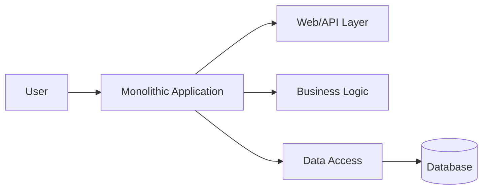

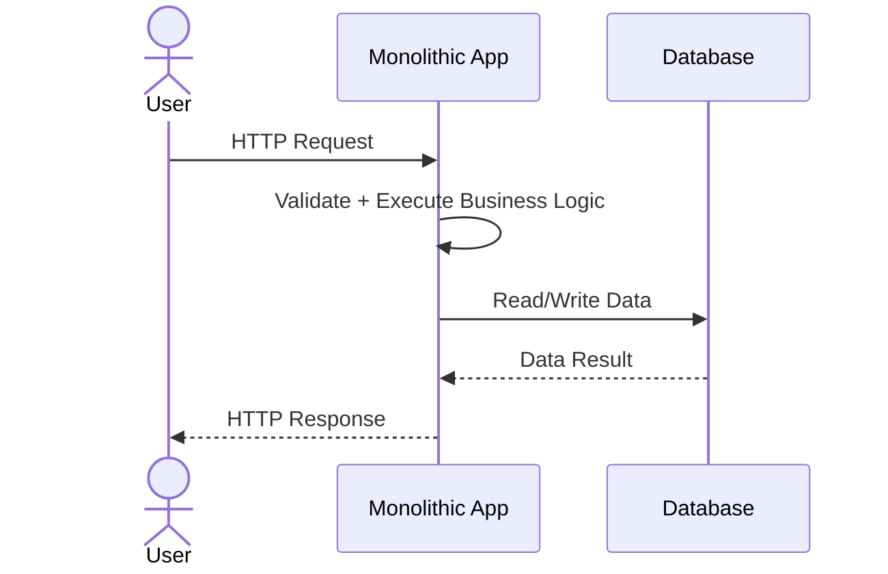

标准 I/O：

| Input | Output |
|---|---|
| 用户请求、表单、API 参数 | 页面、JSON 响应、数据库状态变更 |

深刻含义：所有核心能力在一个部署单元内，简单直接，但边界容易变模糊。

### 2.2 Modular Monolith Architecture

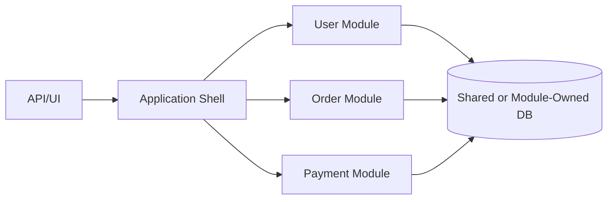

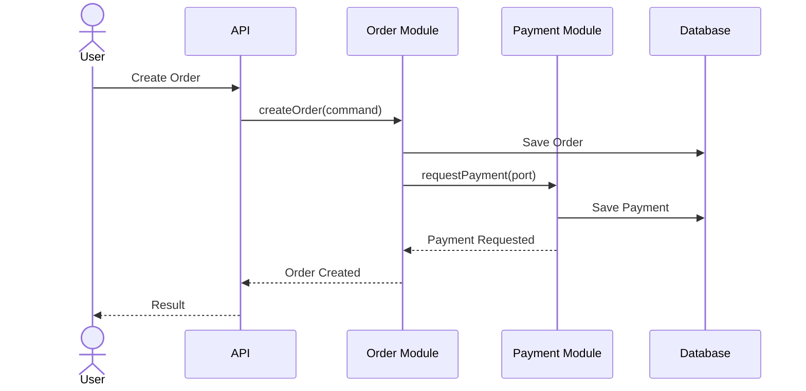

标准 I/O：

| Input | Output |
|---|---|
| 模块级 Command、Query、Domain Event | 模块内部状态变化、模块公开接口结果 |

深刻含义：部署仍然简单，但代码边界先清晰起来，为未来拆服务做准备。

### 2.3 Layered Architecture

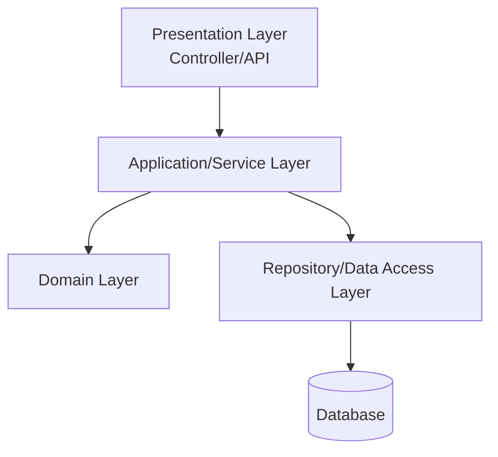

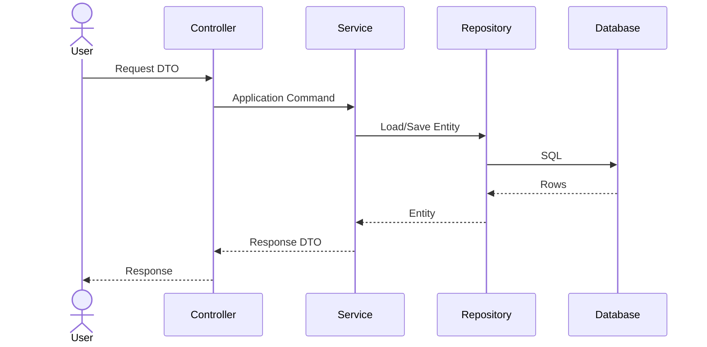

标准 I/O：

| Input | Output |
|---|---|
| Request DTO、Command | Response DTO、数据库变更 |

深刻含义：用层次控制职责位置，避免业务逻辑散落在 Controller、SQL、工具类里。

### 2.4 Clean Architecture

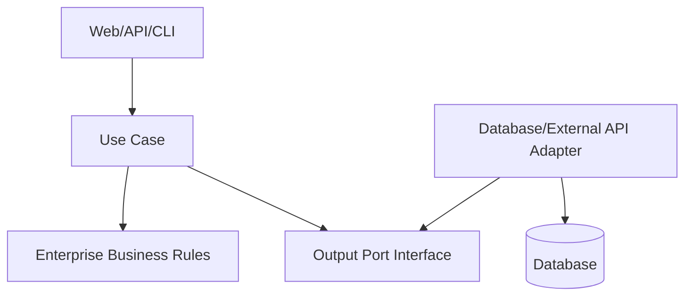

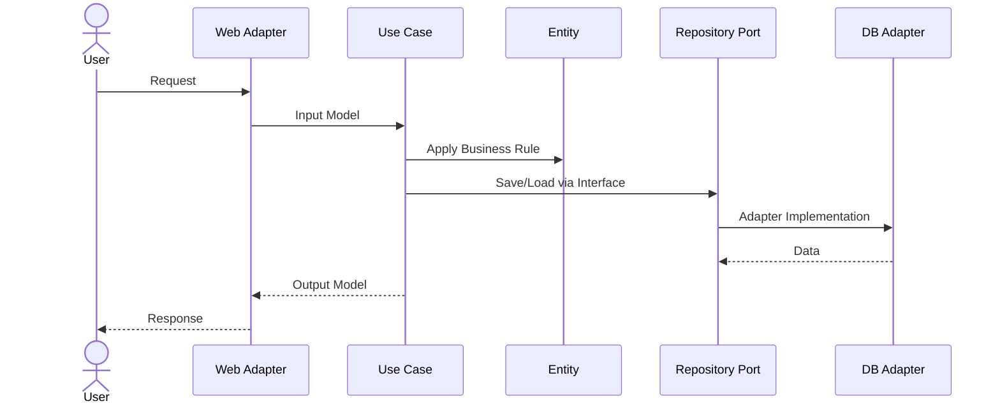

标准 I/O：

| Input | Output |
|---|---|
| Use Case Input Model | Use Case Output Model、业务状态变更 |

深刻含义：业务核心不依赖框架和数据库，外部技术只是可替换的细节。

### 2.5 Hexagonal Architecture

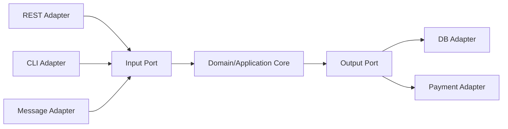

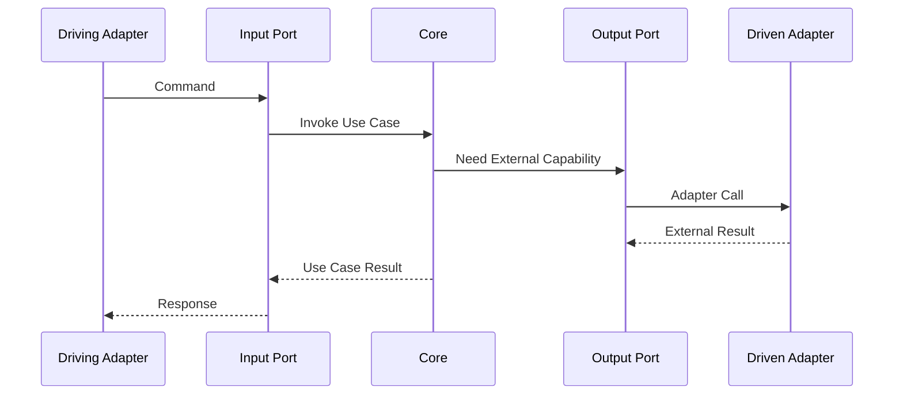

标准 I/O：

| Input | Output |
|---|---|
| Driving Adapter 输入：HTTP、CLI、Message | Driven Adapter 输出：DB 写入、外部 API 调用、事件发布 |

深刻含义：系统核心像六边形中心，所有外部世界都通过端口接入。

### 2.6 Domain-Driven Design Architecture

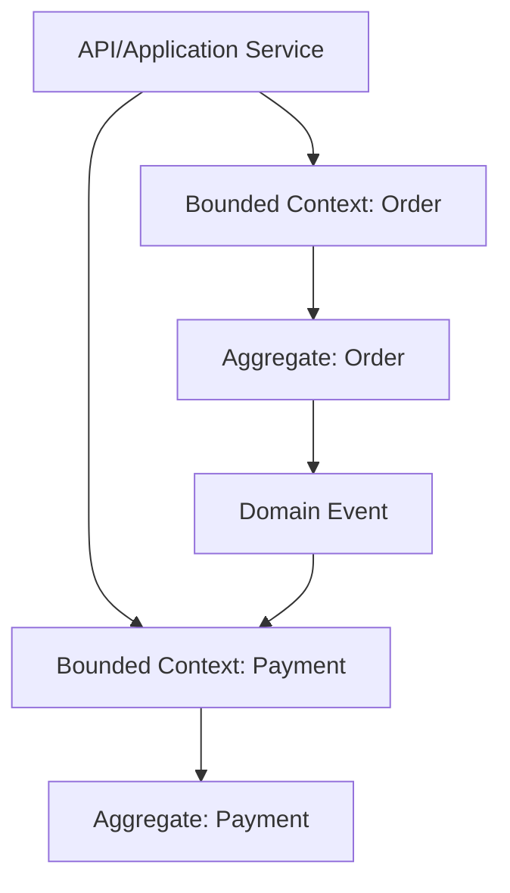

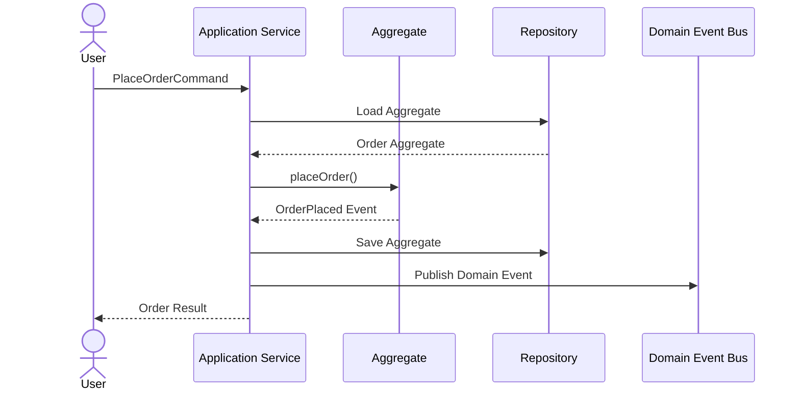

标准 I/O：

| Input | Output |
|---|---|
| 业务 Command、领域对象状态 | Aggregate 状态变化、Domain Event |

深刻含义：代码结构围绕业务语言，而不是围绕数据库表或技术框架。

## 3. Service Architecture

### 3.1 Service-Oriented Architecture

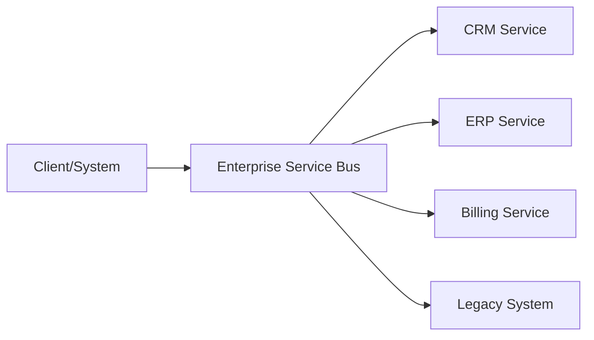

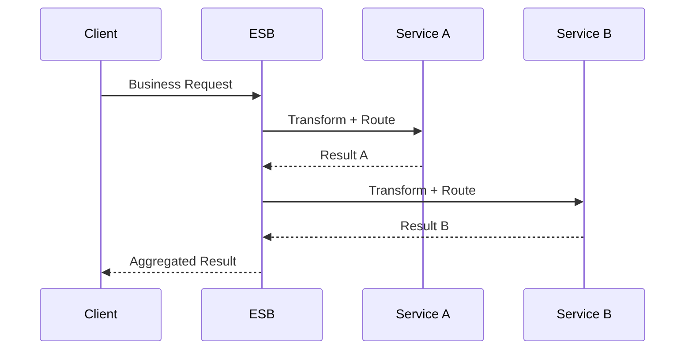

标准 I/O：

| Input | Output |
|---|---|
| 企业系统请求、标准服务消息 | 统一服务响应、跨系统集成结果 |

深刻含义：用中心化集成层复用企业能力，适合复杂传统企业系统。

### 3.2 Microservices Architecture

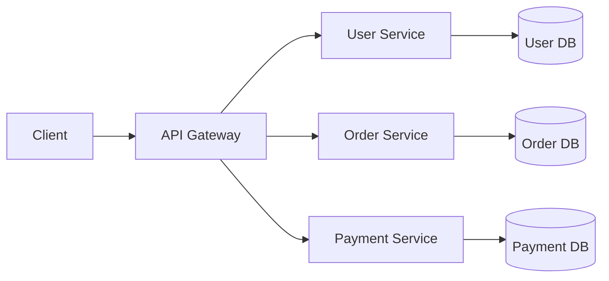

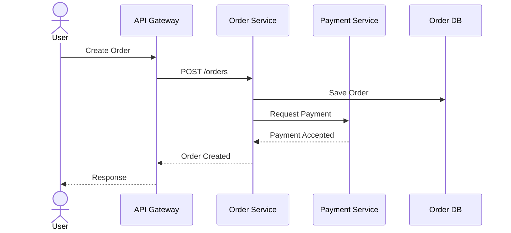

标准 I/O：

| Input | Output |
|---|---|
| API 请求、服务间请求、事件 | 独立服务响应、独立数据库状态变化 |

深刻含义：用服务边界换取团队独立性、独立扩容和局部故障隔离。

### 3.3 API Gateway Architecture

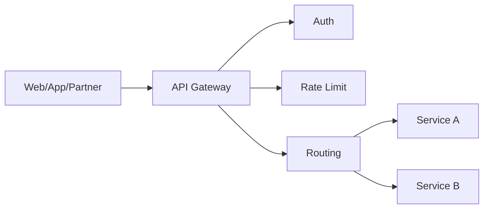

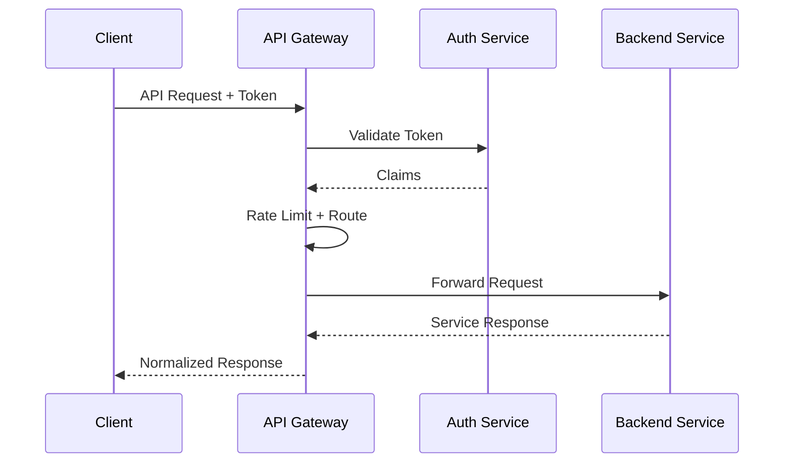

标准 I/O：

| Input | Output |
|---|---|
| 外部 HTTP/RPC 请求、Token、Header | 路由后的内部请求、统一响应、网关日志 |

深刻含义：把对外入口治理集中化，后端服务不直接暴露给所有客户端。

### 3.4 Backend for Frontend Architecture

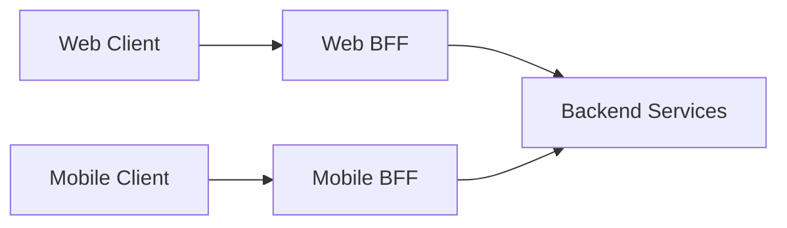

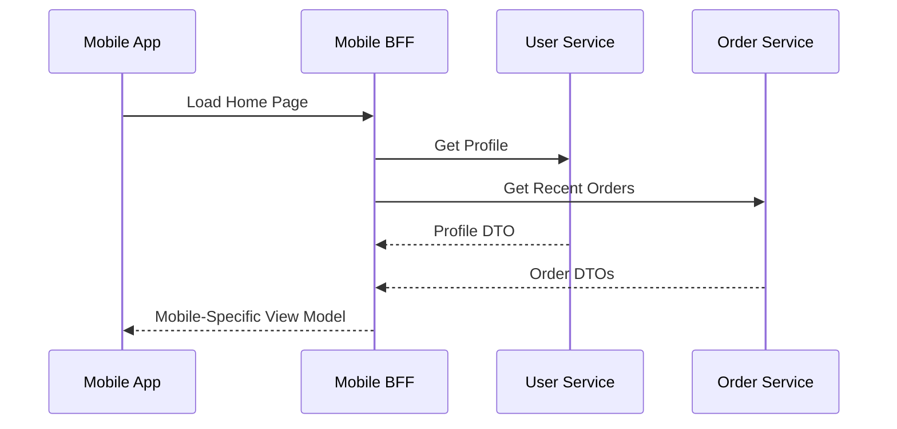

标准 I/O：

| Input | Output |
|---|---|
| 某一端的页面请求、设备上下文 | 面向该端定制的 View Model |

深刻含义：服务 API 面向业务能力，BFF 面向用户体验和页面聚合。

### 3.5 Event-Driven Architecture

```mermaid
flowchart LR
  Producer[Producer Service] --> Broker[(Event Broker)]
  Broker --> C1[Consumer A]
  Broker --> C2[Consumer B]
  Broker --> C3[Consumer C]
```

```mermaid
sequenceDiagram
  participant O as Order Service
  participant K as Event Broker
  participant I as Inventory Service
  participant N as Notification Service
  O->>K: Publish OrderCreated
  K-->>I: Deliver OrderCreated
  K-->>N: Deliver OrderCreated
  I->>I: Reserve Stock
  N->>N: Send Message
```

标准 I/O：

| Input | Output |
|---|---|
| 业务事件、事件 Schema | 订阅者处理结果、新事件、异步状态变化 |

深刻含义：发布方只声明“发生了什么”，不关心后续有多少系统响应。

### 3.6 CQRS Architecture

```mermaid
flowchart LR
  Client --> CommandAPI[Command API]
  Client --> QueryAPI[Query API]
  CommandAPI --> WriteModel[Write Model]
  WriteModel --> WDB[(Write DB)]
  WDB --> Projector[Projection]
  Projector --> RDB[(Read DB)]
  QueryAPI --> RDB
```

```mermaid
sequenceDiagram
  participant C as Client
  participant Cmd as Command API
  participant W as Write DB
  participant P as Projector
  participant R as Read DB
  participant Q as Query API
  C->>Cmd: CreateOrder Command
  Cmd->>W: Save Transactional State
  W-->>P: Change/Event
  P->>R: Update Read Model
  C->>Q: Query Order View
  Q->>R: Read Optimized View
  R-->>Q: View Data
  Q-->>C: Query Result
```

标准 I/O：

| Input | Output |
|---|---|
| Command、Query | 写模型状态变化、读模型查询结果 |

深刻含义：写关注一致性，读关注性能和展示，两者不必被同一个模型绑死。

### 3.7 Event Sourcing Architecture

```mermaid
flowchart LR
  Command[Command] --> Aggregate[Aggregate]
  Aggregate --> Events[(Event Store)]
  Events --> Projection[Projection Builder]
  Projection --> ReadModel[(Read Model)]
```

```mermaid
sequenceDiagram
  participant C as Client
  participant A as Aggregate
  participant ES as Event Store
  participant P as Projection
  C->>A: Change State Command
  A->>ES: Append Domain Event
  ES-->>P: Event Stream
  P->>P: Rebuild Current View
  A-->>C: Accepted
```

标准 I/O：

| Input | Output |
|---|---|
| Command、历史事件流 | 新事件、当前状态投影、审计历史 |

深刻含义：事实来源不是当前状态表，而是完整的事件历史。

### 3.8 Saga Architecture

```mermaid
flowchart LR
  Orchestrator[Saga Orchestrator] --> Order[Order Service]
  Orchestrator --> Inventory[Inventory Service]
  Orchestrator --> Payment[Payment Service]
  Orchestrator --> Shipping[Shipping Service]
```

```mermaid
sequenceDiagram
  participant S as Saga Orchestrator
  participant O as Order
  participant I as Inventory
  participant P as Payment
  S->>O: Create Order
  O-->>S: OK
  S->>I: Reserve Stock
  I-->>S: OK
  S->>P: Charge Payment
  P-->>S: Failed
  S->>I: Compensate Release Stock
  S->>O: Compensate Cancel Order
```

标准 I/O：

| Input | Output |
|---|---|
| 跨服务业务流程请求 | 本地事务结果、补偿动作、最终一致状态 |

深刻含义：分布式事务不再依赖一个大锁，而是通过本地事务加补偿达成最终一致。

### 3.9 Service Mesh Architecture

```mermaid
flowchart LR
  SvcA[Service A] <--> ProxyA[Sidecar Proxy A]
  ProxyA <--> ProxyB[Sidecar Proxy B]
  ProxyB <--> SvcB[Service B]
  Control[Control Plane] --> ProxyA
  Control --> ProxyB
```

```mermaid
sequenceDiagram
  participant A as Service A
  participant PA as Sidecar A
  participant PB as Sidecar B
  participant B as Service B
  A->>PA: Local Request
  PA->>PA: mTLS + Retry + Policy
  PA->>PB: Encrypted Request
  PB->>B: Forward
  B-->>PB: Response
  PB-->>PA: Response
  PA-->>A: Response
```

标准 I/O：

| Input | Output |
|---|---|
| 服务间请求、流量策略、安全策略 | 加密通信、路由结果、遥测数据 |

深刻含义：服务治理从业务代码中抽离，由基础设施统一处理。

## 4. Cloud Native Architecture

### 4.1 Cloud Native Architecture

```mermaid
flowchart TB
  Code[Code] --> Image[Container Image]
  Image --> Registry[Image Registry]
  Registry --> K8s[Kubernetes]
  K8s --> Pods[Pods]
  K8s --> Obs[Observability]
```

```mermaid
sequenceDiagram
  participant Dev as Developer
  participant CI as CI/CD
  participant Reg as Registry
  participant K as Kubernetes
  Dev->>CI: Push Code
  CI->>CI: Test + Build Image
  CI->>Reg: Push Image
  CI->>K: Apply Manifest
  K->>K: Schedule + Health Check
```

标准 I/O：

| Input | Output |
|---|---|
| 代码、镜像、声明式配置 | 可运行服务、弹性伸缩、监控信号 |

深刻含义：系统交付从手工操作变成声明式、自动化、可恢复的流程。

### 4.2 Kubernetes Architecture

```mermaid
flowchart TB
  User[kubectl/API] --> APIServer[API Server]
  APIServer --> Scheduler[Scheduler]
  APIServer --> Controller[Controller Manager]
  APIServer --> ETCD[(etcd)]
  Scheduler --> Node[Worker Node]
  Node --> Pod[Pod]
  Pod --> Container[Container]
```

```mermaid
sequenceDiagram
  participant U as User
  participant API as API Server
  participant S as Scheduler
  participant N as Node/Kubelet
  U->>API: Apply Deployment
  API->>API: Persist Desired State
  API->>S: Need Scheduling
  S->>N: Assign Pod
  N->>N: Pull Image + Start Container
  N-->>API: Pod Status
```

标准 I/O：

| Input | Output |
|---|---|
| YAML Manifest、镜像、资源需求 | Pod、Service、Deployment 状态 |

深刻含义：用户声明期望状态，Kubernetes 不断把现实状态拉回期望状态。

### 4.3 Serverless Architecture

```mermaid
flowchart LR
  Event[Event Source] --> Function[Function]
  Function --> Service[Managed Service]
  Function --> DB[(Database)]
```

```mermaid
sequenceDiagram
  participant E as Event Source
  participant F as Function Runtime
  participant D as Database
  E->>F: Trigger Event
  F->>F: Cold/Warm Start
  F->>D: Read/Write
  D-->>F: Result
  F-->>E: Success/Failure
```

标准 I/O：

| Input | Output |
|---|---|
| 事件、HTTP 请求、定时触发 | 函数结果、下游服务调用、状态变更 |

深刻含义：计算资源由平台按事件自动调度，开发者关注业务函数。

### 4.4 Cell-Based Architecture

```mermaid
flowchart LR
  Router[Cell Router] --> Cell1[Cell 1<br/>App + DB]
  Router --> Cell2[Cell 2<br/>App + DB]
  Router --> Cell3[Cell 3<br/>App + DB]
  Control[Control Plane] --> Router
```

```mermaid
sequenceDiagram
  participant U as User
  participant R as Cell Router
  participant C as Assigned Cell
  participant D as Cell DB
  U->>R: Request with Tenant/User
  R->>R: Resolve Cell
  R->>C: Forward Request
  C->>D: Read/Write Local Cell Data
  C-->>R: Response
  R-->>U: Response
```

标准 I/O：

| Input | Output |
|---|---|
| 用户/租户请求、分区规则 | 指定 Cell 的处理结果、隔离后的状态 |

深刻含义：不是一个大系统服务所有人，而是多个小系统分摊用户和风险。

### 4.5 Multi-Region Active-Active Architecture

```mermaid
flowchart LR
  DNS[Global DNS/Traffic Manager] --> R1[Region A]
  DNS --> R2[Region B]
  R1 --> DB1[(Regional DB A)]
  R2 --> DB2[(Regional DB B)]
  DB1 <--> DB2
```

```mermaid
sequenceDiagram
  participant U as User
  participant T as Traffic Manager
  participant R as Nearest Region
  participant DB as Regional DB
  participant Peer as Peer Region
  U->>T: Request
  T->>R: Route by Latency/Health
  R->>DB: Local Read/Write
  DB-->>Peer: Replicate
  R-->>U: Response
```

标准 I/O：

| Input | Output |
|---|---|
| 全球用户请求、健康检查、复制日志 | 低延迟响应、跨地域复制、灾备能力 |

深刻含义：用地域冗余换取低延迟和高可用，但必须处理一致性复杂度。

### 4.6 Edge Architecture

```mermaid
flowchart LR
  User --> Edge[Edge Node/CDN/Worker]
  Edge --> Cache[(Edge Cache)]
  Edge --> Origin[Origin Service]
```

```mermaid
sequenceDiagram
  participant U as User
  participant E as Edge
  participant C as Cache
  participant O as Origin
  U->>E: Request
  E->>C: Check Cache
  alt Cache Hit
    C-->>E: Cached Content
  else Cache Miss
    E->>O: Fetch Origin
    O-->>E: Origin Response
    E->>C: Store
  end
  E-->>U: Response
```

标准 I/O：

| Input | Output |
|---|---|
| 用户边缘请求、缓存策略、边缘函数 | 缓存响应、源站请求、边缘计算结果 |

深刻含义：把计算和缓存前移，让用户少走远路，源站少承压。

## 5. Data Architecture

### 5.1 Data Warehouse Architecture

```mermaid
flowchart LR
  Sources[Business DBs/SaaS/Logs] --> ETL[ETL/ELT]
  ETL --> DWH[(Data Warehouse)]
  DWH --> Mart[Data Mart]
  Mart --> BI[BI Dashboard]
```

```mermaid
sequenceDiagram
  participant S as Source Systems
  participant E as ETL/ELT
  participant W as Warehouse
  participant B as BI
  S->>E: Extract Data
  E->>E: Clean + Transform
  E->>W: Load Modeled Tables
  B->>W: Query Metrics
  W-->>B: Report Dataset
```

标准 I/O：

| Input | Output |
|---|---|
| 业务数据、日志、第三方数据 | 指标表、报表、BI 数据集 |

深刻含义：把分散业务数据变成统一口径的经营分析资产。

### 5.2 Data Lake Architecture

```mermaid
flowchart LR
  Sources[Raw Sources] --> Ingest[Ingestion]
  Ingest --> Lake[(Object Storage Data Lake)]
  Lake --> Catalog[Metadata Catalog]
  Lake --> Compute[Batch/ML/Query Engine]
```

```mermaid
sequenceDiagram
  participant S as Sources
  participant I as Ingestion
  participant L as Data Lake
  participant C as Catalog
  participant Q as Query/ML
  S->>I: Raw Data
  I->>L: Store As-Is
  I->>C: Register Metadata
  Q->>C: Discover Dataset
  Q->>L: Read Raw/Processed Data
```

标准 I/O：

| Input | Output |
|---|---|
| 原始结构化/半结构化/非结构化数据 | 可发现的数据集、训练数据、分析输入 |

深刻含义：先把数据低成本沉淀下来，再按需求治理和加工。

### 5.3 Lakehouse Architecture

```mermaid
flowchart LR
  Data[Raw/Stream Data] --> Table[Open Table Format<br/>Delta/Iceberg/Hudi]
  Table --> Storage[(Object Storage)]
  Table --> BI[BI Query]
  Table --> ML[ML Training]
  Table --> Stream[Streaming Job]
```

```mermaid
sequenceDiagram
  participant J as Job
  participant T as Lakehouse Table
  participant S as Object Storage
  participant Q as Query Engine
  J->>T: Upsert/Append Data
  T->>S: Write Data + Metadata
  Q->>T: SQL Query
  T->>S: Read Snapshots
  S-->>Q: Consistent Data
```

标准 I/O：

| Input | Output |
|---|---|
| 批数据、流数据、表变更 | ACID 表、快照、BI/AI 统一数据 |

深刻含义：让数据湖具备数据仓库级别的表管理和一致性。

### 5.4 Streaming Architecture

```mermaid
flowchart LR
  Source[Event Source] --> Broker[(Kafka/Pulsar)]
  Broker --> StreamJob[Stream Processing]
  StreamJob --> Sink1[(Real-time Store)]
  StreamJob --> Sink2[Alert/Action]
```

```mermaid
sequenceDiagram
  participant S as Source
  participant B as Broker
  participant F as Stream Job
  participant O as Output Store
  S->>B: Append Event
  B-->>F: Consume Event
  F->>F: Window/State/Join
  F->>O: Write Result
```

标准 I/O：

| Input | Output |
|---|---|
| 连续事件流 | 实时指标、告警、实时特征、下游事件 |

深刻含义：数据不是等一天再处理，而是在产生时就被计算和响应。

### 5.5 Lambda Architecture

```mermaid
flowchart LR
  Data[Data Stream] --> Batch[Batch Layer]
  Data --> Speed[Speed Layer]
  Batch --> Serving[Serving Layer]
  Speed --> Serving
  Serving --> Query[Query API]
```

```mermaid
sequenceDiagram
  participant D as Data Source
  participant B as Batch Layer
  participant S as Speed Layer
  participant V as Serving Layer
  D->>B: Historical Data
  D->>S: Real-time Data
  B->>V: Accurate Batch View
  S->>V: Low-Latency View
  V-->>V: Merge Query Result
```

标准 I/O：

| Input | Output |
|---|---|
| 历史数据、实时数据 | 准确批视图、实时近似视图、合并查询结果 |

深刻含义：用两条链路同时满足准确性和实时性。

### 5.6 Kappa Architecture

```mermaid
flowchart LR
  Events[(Immutable Log)] --> StreamJob[Stream Processor]
  StreamJob --> View[(Serving View)]
  Events --> Replay[Replay]
  Replay --> StreamJob
```

```mermaid
sequenceDiagram
  participant L as Event Log
  participant F as Stream Processor
  participant V as Serving View
  L-->>F: Consume Events
  F->>V: Update View
  alt Need Recompute
    L-->>F: Replay From Offset
    F->>V: Rebuild View
  end
```

标准 I/O：

| Input | Output |
|---|---|
| 不可变事件日志 | 实时视图、重放后的修正视图 |

深刻含义：只保留一套流处理逻辑，用日志重放替代批流两套代码。

### 5.7 Change Data Capture Architecture

```mermaid
flowchart LR
  DB[(Operational DB)] --> Log[Binlog/WAL]
  Log --> CDC[CDC Connector]
  CDC --> Broker[(Kafka)]
  Broker --> Search[(Search)]
  Broker --> DWH[(Warehouse)]
```

```mermaid
sequenceDiagram
  participant App as App
  participant DB as Database
  participant CDC as CDC Connector
  participant K as Kafka
  participant S as Sink
  App->>DB: Insert/Update/Delete
  DB-->>CDC: Binlog/WAL Change
  CDC->>K: Publish Change Event
  K-->>S: Deliver Change
  S->>S: Update Projection
```

标准 I/O：

| Input | Output |
|---|---|
| 数据库变更日志 | 变更事件、搜索索引、分析表、缓存同步 |

深刻含义：不侵入业务代码，也能把业务库变化可靠同步到下游。

### 5.8 Data Mesh Architecture

```mermaid
flowchart LR
  DomainA[Domain Team A] --> ProductA[Data Product A]
  DomainB[Domain Team B] --> ProductB[Data Product B]
  Platform[Self-Serve Data Platform] --> ProductA
  Platform --> ProductB
  Governance[Federated Governance] --> ProductA
  Governance --> ProductB
  Users[Data Consumers] --> ProductA
  Users --> ProductB
```

```mermaid
sequenceDiagram
  participant D as Domain Team
  participant P as Data Platform
  participant G as Governance
  participant C as Consumer
  D->>P: Publish Data Product
  P->>G: Validate Policy/Metadata
  G-->>P: Approved
  C->>P: Discover Dataset
  P-->>C: Contract + Access Path
  C->>P: Consume Data Product
```

标准 I/O：

| Input | Output |
|---|---|
| 领域数据、数据契约、治理策略 | Data Product、元数据、可消费数据服务 |

深刻含义：数据不再只是中心团队的资产，而是每个业务领域负责的产品。

## 6. AI Architecture

### 6.1 Machine Learning Platform Architecture

```mermaid
flowchart LR
  Data[Data] --> Feature[Feature Engineering]
  Feature --> Train[Training Pipeline]
  Train --> Registry[Model Registry]
  Registry --> Serving[Model Serving]
  Serving --> Monitor[Monitoring]
```

```mermaid
sequenceDiagram
  participant D as Data Store
  participant T as Training Pipeline
  participant R as Model Registry
  participant S as Serving
  participant M as Monitor
  T->>D: Load Training Data
  T->>T: Train + Evaluate
  T->>R: Register Model
  S->>R: Load Approved Model
  S->>M: Emit Prediction Metrics
```

标准 I/O：

| Input | Output |
|---|---|
| 训练数据、特征、标签、训练配置 | 模型文件、评估指标、在线预测结果 |

深刻含义：把模型从实验脚本变成可重复、可发布、可监控的软件资产。

### 6.2 MLOps Architecture

```mermaid
flowchart LR
  Code[Code] --> Pipeline[ML Pipeline]
  Data[Versioned Data] --> Pipeline
  Pipeline --> Experiment[Experiment Tracking]
  Pipeline --> Registry[Model Registry]
  Registry --> Deploy[Deployment]
  Deploy --> Monitor[Model Monitor]
```

```mermaid
sequenceDiagram
  participant DS as Data Scientist
  participant P as Pipeline
  participant E as Experiment Tracker
  participant R as Registry
  participant Prod as Production
  DS->>P: Submit Code + Config
  P->>E: Log Params/Metrics
  P->>R: Register Candidate
  R->>Prod: Promote Model
  Prod-->>E: Online Metrics
```

标准 I/O：

| Input | Output |
|---|---|
| 数据版本、代码版本、参数 | 可追踪实验、模型版本、部署记录、漂移告警 |

深刻含义：模型质量不仅靠算法，还靠版本、流水线、评测和回滚机制。

### 6.3 RAG Architecture

```mermaid
flowchart LR
  Docs[Documents] --> Chunk[Chunking]
  Chunk --> Embed[Embedding]
  Embed --> VDB[(Vector DB)]
  User[User Question] --> Retrieve[Retriever]
  VDB --> Retrieve
  Retrieve --> LLM[LLM]
  LLM --> Answer[Answer]
```

```mermaid
sequenceDiagram
  actor U as User
  participant R as Retriever
  participant V as Vector DB
  participant L as LLM
  U->>R: Question
  R->>V: Similarity Search
  V-->>R: Relevant Chunks
  R->>L: Question + Context
  L-->>U: Grounded Answer
```

标准 I/O：

| Input | Output |
|---|---|
| 用户问题、文档、Embedding | 检索上下文、带依据的模型回答 |

深刻含义：让模型先“查资料”再回答，降低幻觉并接入私有知识。

### 6.4 Agentic Architecture

```mermaid
flowchart LR
  User[User Goal] --> Planner[Planner]
  Planner --> Agent[Agent Loop]
  Agent --> Tools[Tools/APIs]
  Agent --> Memory[Memory]
  Agent --> Eval[Evaluator/Guardrails]
  Tools --> Result[Task Result]
```

```mermaid
sequenceDiagram
  actor U as User
  participant A as Agent
  participant T as Tool
  participant E as Evaluator
  U->>A: Goal
  A->>A: Plan Steps
  A->>T: Call Tool
  T-->>A: Observation
  A->>E: Check Result/Risk
  E-->>A: Pass or Revise
  A-->>U: Final Result
```

标准 I/O：

| Input | Output |
|---|---|
| 用户目标、工具权限、上下文 | 多步骤执行结果、工具调用记录、最终产物 |

深刻含义：AI 从回答者变成执行者，架构重点变成规划、工具、安全和反馈循环。

### 6.5 LLMOps Architecture

```mermaid
flowchart LR
  Prompt[Prompt/Template] --> Gateway[LLM Gateway]
  Model[Model Config] --> Gateway
  Gateway --> LLM[LLM Provider]
  Gateway --> Trace[Trace Store]
  Trace --> Eval[Evaluation]
  Eval --> Monitor[Quality/Cost Monitor]
```

```mermaid
sequenceDiagram
  participant App as App
  participant G as LLM Gateway
  participant L as LLM
  participant T as Trace
  participant E as Evaluator
  App->>G: Prompt + Context
  G->>L: Routed Request
  L-->>G: Completion
  G->>T: Save Trace
  T->>E: Evaluate Sample
  G-->>App: Response
```

标准 I/O：

| Input | Output |
|---|---|
| Prompt、上下文、模型配置、评测集 | 模型输出、Trace、质量指标、成本指标 |

深刻含义：大模型应用上线后，Prompt、模型、评测和成本都要像软件一样治理。

### 6.6 Vector Database Architecture

```mermaid
flowchart LR
  Content[Text/Image/Code] --> Emb[Embedding Model]
  Emb --> VDB[(Vector Database)]
  Query[Query] --> QEmb[Query Embedding]
  QEmb --> VDB
  VDB --> Results[Nearest Neighbors]
```

```mermaid
sequenceDiagram
  participant C as Content
  participant E as Embedding Model
  participant V as Vector DB
  participant Q as Query
  C->>E: Create Vector
  E->>V: Upsert Vector + Metadata
  Q->>E: Query Vector
  E->>V: Search Similar Vectors
  V-->>Q: Top-K Results
```

标准 I/O：

| Input | Output |
|---|---|
| 文本/图片/代码、查询 | 向量、Top-K 相似结果、元数据 |

深刻含义：把非结构化内容转成可计算的语义空间。

## 7. Engineering Productivity Architecture

### 7.1 DevOps Architecture

```mermaid
flowchart LR
  Dev[Develop] --> CI[CI]
  CI --> Test[Test]
  Test --> CD[CD]
  CD --> Prod[Production]
  Prod --> Monitor[Monitor]
  Monitor --> Dev
```

```mermaid
sequenceDiagram
  participant Dev as Developer
  participant CI as CI
  participant CD as CD
  participant P as Production
  participant M as Monitoring
  Dev->>CI: Push Code
  CI->>CI: Build + Test
  CI->>CD: Artifact
  CD->>P: Deploy
  P->>M: Metrics/Logs
  M-->>Dev: Feedback
```

标准 I/O：

| Input | Output |
|---|---|
| 代码提交、测试配置、部署配置 | 构建产物、测试结果、发布状态、监控反馈 |

深刻含义：开发到运维形成闭环，交付不再靠手工接力。

### 7.2 GitOps Architecture

```mermaid
flowchart LR
  Git[(Git Repo)] --> Controller[GitOps Controller]
  Controller --> Cluster[Kubernetes Cluster]
  Cluster --> Drift[Drift Detection]
  Drift --> Controller
```

```mermaid
sequenceDiagram
  participant Dev as Developer
  participant Git as Git Repo
  participant C as GitOps Controller
  participant K as Cluster
  Dev->>Git: Commit Desired State
  C->>Git: Watch Changes
  C->>K: Apply Manifests
  K-->>C: Current State
  C->>C: Reconcile Drift
```

标准 I/O：

| Input | Output |
|---|---|
| Git 中的声明式配置 | 集群实际状态、同步记录、漂移修复 |

深刻含义：Git 是环境状态的事实来源，线上变更天然可审计和回滚。

### 7.3 Platform Engineering Architecture

```mermaid
flowchart LR
  Dev[Developer] --> Portal[Developer Portal]
  Portal --> Templates[Golden Path Templates]
  Portal --> CI[CI/CD]
  Portal --> Infra[Infrastructure APIs]
  Portal --> Obs[Observability]
```

```mermaid
sequenceDiagram
  participant D as Developer
  participant P as Platform
  participant T as Template
  participant I as Infra
  participant C as CI/CD
  D->>P: Create New Service
  P->>T: Generate Scaffold
  P->>I: Provision Resources
  P->>C: Create Pipeline
  P-->>D: Ready Service
```

标准 I/O：

| Input | Output |
|---|---|
| 服务创建请求、模板参数 | 服务脚手架、资源、流水线、标准能力 |

深刻含义：平台把复杂基础设施包装成研发可自助使用的产品。

### 7.4 Internal Developer Platform Architecture

```mermaid
flowchart LR
  Dev[Developer] --> IDP[Internal Developer Platform]
  IDP --> Catalog[Service Catalog]
  IDP --> Docs[Docs]
  IDP --> Scaffolder[Scaffolder]
  IDP --> Runtime[Runtime Status]
```

```mermaid
sequenceDiagram
  participant D as Developer
  participant I as IDP
  participant C as Catalog
  participant S as Scaffolder
  D->>I: Search Service/Create Service
  I->>C: Lookup Ownership/Metadata
  alt Create
    I->>S: Generate Service
    S-->>I: Repo + Pipeline
  end
  I-->>D: Unified Developer View
```

标准 I/O：

| Input | Output |
|---|---|
| 研发动作、服务元数据、模板参数 | 服务目录、脚手架、文档入口、运行状态 |

深刻含义：把分散工具统一成研发入口，降低大团队认知成本。

### 7.5 Observability Architecture

```mermaid
flowchart LR
  App[Applications] --> Metrics[Metrics]
  App --> Logs[Logs]
  App --> Traces[Traces]
  Metrics --> Store[Telemetry Store]
  Logs --> Store
  Traces --> Store
  Store --> Dashboard[Dashboard/Alert]
```

```mermaid
sequenceDiagram
  participant A as App
  participant C as Collector
  participant S as Telemetry Store
  participant D as Dashboard
  A->>C: Metrics/Logs/Traces
  C->>S: Normalize + Export
  D->>S: Query
  S-->>D: System View
```

标准 I/O：

| Input | Output |
|---|---|
| Metrics、Logs、Traces、Events、Profiles | Dashboard、Alert、Trace Timeline、根因线索 |

深刻含义：系统运行状态必须被看见，否则复杂系统只能靠猜。

### 7.6 SRE Architecture

```mermaid
flowchart LR
  UserJourney[User Journey] --> SLI[SLI]
  SLI --> SLO[SLO]
  SLO --> ErrorBudget[Error Budget]
  ErrorBudget --> Release[Release Decision]
  Incident[Incident] --> Postmortem[Postmortem]
  Postmortem --> ReliabilityWork[Reliability Work]
```

```mermaid
sequenceDiagram
  participant M as Monitoring
  participant S as SRE
  participant T as Team
  participant P as Production
  M->>S: SLO Burn Alert
  S->>T: Incident Response
  T->>P: Mitigate/Rollback
  P-->>M: Recovery Signals
  S->>T: Postmortem + Action Items
```

标准 I/O：

| Input | Output |
|---|---|
| SLI 数据、告警、故障事件 | SLO、Error Budget、复盘行动、可靠性改进 |

深刻含义：稳定性不靠口号，而靠指标、预算、自动化和复盘机制。

## 8. Security Architecture

### 8.1 Zero Trust Architecture

```mermaid
flowchart LR
  User[User/Device] --> Policy[Policy Decision Point]
  Policy --> Identity[Identity Provider]
  Policy --> Device[Device Posture]
  Policy --> App[Protected App]
```

```mermaid
sequenceDiagram
  participant U as User
  participant PEP as Policy Enforcement Point
  participant PDP as Policy Decision Point
  participant IDP as Identity Provider
  participant App as App
  U->>PEP: Access Request
  PEP->>IDP: Verify Identity
  PEP->>PDP: Check Policy + Context
  PDP-->>PEP: Allow/Deny
  alt Allow
    PEP->>App: Forward Request
    App-->>U: Response
  else Deny
    PEP-->>U: Denied
  end
```

标准 I/O：

| Input | Output |
|---|---|
| 身份、设备、位置、风险、资源请求 | Allow/Deny、审计日志、最小权限访问 |

深刻含义：不因为你在内网就信任你，每一次访问都重新验证。

### 8.2 IAM Architecture

```mermaid
flowchart LR
  User[User/Service Account] --> IdP[Identity Provider]
  IdP --> Token[Token/Session]
  Token --> Resource[Protected Resource]
  Policy[RBAC/ABAC Policy] --> Resource
```

```mermaid
sequenceDiagram
  participant U as User
  participant I as IdP
  participant R as Resource Server
  participant P as Policy Engine
  U->>I: Login
  I-->>U: Token
  U->>R: Request + Token
  R->>P: Check Permission
  P-->>R: Allow/Deny
  R-->>U: Result
```

标准 I/O：

| Input | Output |
|---|---|
| 用户身份、角色、属性、访问请求 | Token、权限决策、访问结果、审计记录 |

深刻含义：身份和权限是系统边界的第一等公民，不是业务代码里的零散 if。

### 8.3 Policy as Code Architecture

```mermaid
flowchart LR
  Input[Request/Config] --> Engine[Policy Engine]
  Policy[Policy Code] --> Engine
  Data[Context Data] --> Engine
  Engine --> Decision[Allow/Deny/Mutate]
```

```mermaid
sequenceDiagram
  participant C as CI/K8s/API
  participant E as Policy Engine
  participant P as Policy Repo
  C->>E: Input Document
  E->>P: Load Policy
  E->>E: Evaluate
  E-->>C: Decision + Reason
```

标准 I/O：

| Input | Output |
|---|---|
| 配置、请求、上下文、策略代码 | 决策结果、拒绝原因、合规报告 |

深刻含义：安全和合规规则可版本化、可测试、可审计。

### 8.4 Audit Architecture

```mermaid
flowchart LR
  App[Applications] --> AuditLog[Audit Log Collector]
  IAM[IAM] --> AuditLog
  DB[(Database)] --> AuditLog
  AuditLog --> Store[(Immutable Audit Store)]
  Store --> Search[Search/Report]
```

```mermaid
sequenceDiagram
  participant U as User
  participant A as App
  participant L as Audit Logger
  participant S as Audit Store
  participant R as Reviewer
  U->>A: Sensitive Operation
  A->>L: Write Audit Event
  L->>S: Append Immutable Record
  R->>S: Search Evidence
  S-->>R: Audit Trail
```

标准 I/O：

| Input | Output |
|---|---|
| 用户操作、权限变更、数据访问、系统事件 | 不可篡改审计记录、追责证据、合规报告 |

深刻含义：系统不仅要能做事，还要能回答“谁在什么时候为什么做了什么”。

## 9. High Performance and Resilience Architecture

### 9.1 Cache Architecture

```mermaid
flowchart LR
  Client --> App[Application]
  App --> Local[Local Cache]
  App --> Redis[(Redis Cache)]
  App --> DB[(Database)]
```

```mermaid
sequenceDiagram
  participant C as Client
  participant A as App
  participant Cache as Cache
  participant DB as Database
  C->>A: Query
  A->>Cache: Get Key
  alt Cache Hit
    Cache-->>A: Value
  else Cache Miss
    A->>DB: Query DB
    DB-->>A: Data
    A->>Cache: Set Key
  end
  A-->>C: Result
```

标准 I/O：

| Input | Output |
|---|---|
| 读请求、缓存 Key、TTL 策略 | 缓存命中结果、数据库回源、缓存更新 |

深刻含义：把热点读从慢资源迁移到快资源，但要处理一致性和失效。

### 9.2 Sharding Architecture

```mermaid
flowchart LR
  App[Application] --> Router[Shard Router]
  Router --> DB1[(Shard 1)]
  Router --> DB2[(Shard 2)]
  Router --> DB3[(Shard 3)]
```

```mermaid
sequenceDiagram
  participant A as App
  participant R as Shard Router
  participant S as Target Shard
  A->>R: Query with Shard Key
  R->>R: Calculate Shard
  R->>S: Execute SQL
  S-->>R: Rows
  R-->>A: Result
```

标准 I/O：

| Input | Output |
|---|---|
| 带分片键的读写请求 | 路由到目标分片的 SQL、局部数据结果 |

深刻含义：把单库压力拆散，但跨分片查询和事务会变复杂。

### 9.3 Read-Write Splitting Architecture

```mermaid
flowchart LR
  App[Application] --> Router[Read/Write Router]
  Router --> Primary[(Primary DB)]
  Router --> Replica1[(Read Replica 1)]
  Router --> Replica2[(Read Replica 2)]
  Primary --> Replica1
  Primary --> Replica2
```

```mermaid
sequenceDiagram
  participant A as App
  participant R as Router
  participant P as Primary
  participant RR as Replica
  A->>R: Write Request
  R->>P: Write
  P-->>RR: Replicate
  A->>R: Read Request
  R->>RR: Read
  RR-->>A: Result
```

标准 I/O：

| Input | Output |
|---|---|
| 读请求、写请求、路由规则 | 写入主库、读取从库、复制延迟状态 |

深刻含义：用复制扩展读能力，但必须理解“读到旧数据”的风险。

### 9.4 Circuit Breaker and Bulkhead Architecture

```mermaid
flowchart LR
  App[Application] --> CB[Circuit Breaker]
  CB --> PoolA[Bulkhead Pool A]
  PoolA --> Dep[Dependency Service]
  CB --> Fallback[Fallback]
```

```mermaid
sequenceDiagram
  participant A as App
  participant CB as Circuit Breaker
  participant D as Dependency
  A->>CB: Call Dependency
  alt Circuit Closed
    CB->>D: Forward Call
    D-->>CB: Timeout/Error
    CB->>CB: Count Failure
  else Circuit Open
    CB-->>A: Fallback Fast
  end
```

标准 I/O：

| Input | Output |
|---|---|
| 下游调用、超时、错误率、资源池配置 | 正常响应、快速失败、Fallback、隔离效果 |

深刻含义：故障不可避免，架构要阻止局部故障拖垮全局。

### 9.5 Rate Limiting and Degradation Architecture

```mermaid
flowchart LR
  Client --> Limiter[Rate Limiter]
  Limiter --> Core[Core Service]
  Limiter --> Reject[Reject/Queue]
  Core --> Feature[Optional Feature]
  Core --> Degrade[Degraded Response]
```

```mermaid
sequenceDiagram
  participant C as Client
  participant L as Rate Limiter
  participant S as Service
  C->>L: Request
  alt Under Limit
    L->>S: Forward
    S-->>C: Full Response
  else Over Limit
    L-->>C: Reject or Degraded Response
  end
```

标准 I/O：

| Input | Output |
|---|---|
| 请求流量、限流规则、降级开关 | 通过、拒绝、排队、降级响应 |

深刻含义：保护核心链路比满足每个请求更重要。

## 10. Frontend and Client Architecture

### 10.1 Micro Frontends Architecture

```mermaid
flowchart LR
  Shell[App Shell] --> MF1[Micro Frontend A]
  Shell --> MF2[Micro Frontend B]
  Shell --> MF3[Micro Frontend C]
  MF1 --> API1[API A]
  MF2 --> API2[API B]
```

```mermaid
sequenceDiagram
  participant U as User
  participant S as App Shell
  participant R as Route Registry
  participant M as Micro Frontend
  U->>S: Open Route
  S->>R: Resolve App
  S->>M: Load Bundle
  M->>M: Mount
  M-->>U: Page View
```

标准 I/O：

| Input | Output |
|---|---|
| 路由、远程 Bundle、用户交互 | 子应用挂载、页面视图、独立发布单元 |

深刻含义：前端也需要团队边界和独立交付，不只是后端要拆服务。

### 10.2 Component-Based Architecture

```mermaid
flowchart TB
  Page[Page] --> Layout[Layout Component]
  Layout --> Card[Card Component]
  Layout --> Table[Table Component]
  Card --> Button[Button Component]
  Table --> Button
```

```mermaid
sequenceDiagram
  participant P as Page
  participant C as Component
  participant E as Event Handler
  P->>C: Props
  C->>C: Render UI
  C->>E: User Event
  E-->>P: State Change
  P->>C: New Props
```

标准 I/O：

| Input | Output |
|---|---|
| Props、State、Events | UI、事件回调、状态变化 |

深刻含义：页面由稳定的小组件组合而成，复用和一致性来自组件边界。

### 10.3 Design System Architecture

```mermaid
flowchart LR
  Tokens[Design Tokens] --> Components[Component Library]
  Guidelines[Guidelines] --> Components
  Components --> Apps[Product Apps]
  Components --> Docs[Storybook/Docs]
```

```mermaid
sequenceDiagram
  participant D as Designer
  participant DS as Design System
  participant FE as Frontend App
  D->>DS: Define Token/Component Spec
  DS->>DS: Implement Component
  FE->>DS: Import Component
  DS-->>FE: Consistent UI
```

标准 I/O：

| Input | Output |
|---|---|
| Token、组件规范、交互规范 | 可复用组件、文档、统一体验 |

深刻含义：设计不只是视觉稿，而是可复用、可治理、可演进的产品基础设施。

## 11. How to Read Code with These Diagrams

读别人代码时，可以套这个模板：

1. 先判断入口：HTTP、CLI、Message、定时任务还是用户界面？
2. 找业务核心：真正的业务规则在哪一层、哪个模块、哪个 Aggregate？
3. 看依赖方向：业务是否依赖框架、数据库、外部 API？
4. 看状态位置：状态存在 DB、Event Store、Cache、Vector DB、Read Model 还是浏览器？
5. 看通信方式：同步 RPC、异步事件、CDC、流处理还是 Agent Tool Call？
6. 看失败路径：限流、熔断、补偿、重试、降级、审计是否存在？
7. 看输入输出：一个模块吃什么、吐什么，边界是否清晰？

如果你能从代码里画出这三样东西，就说明你已经从“读语法”进入“读架构”：

- Component Diagram：系统由哪些块组成。
- Sequence Diagram：一次请求/事件怎么流动。
- I/O Contract：每个边界的输入输出是什么。
