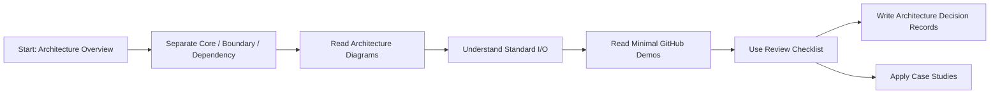
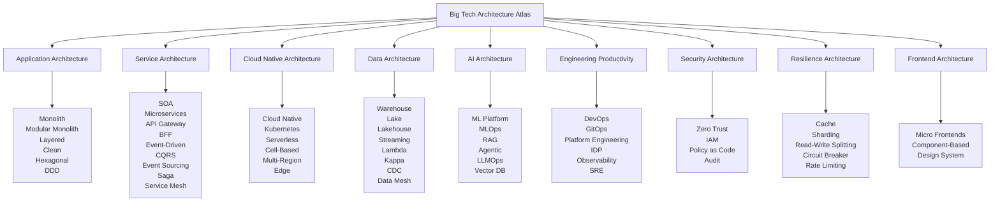
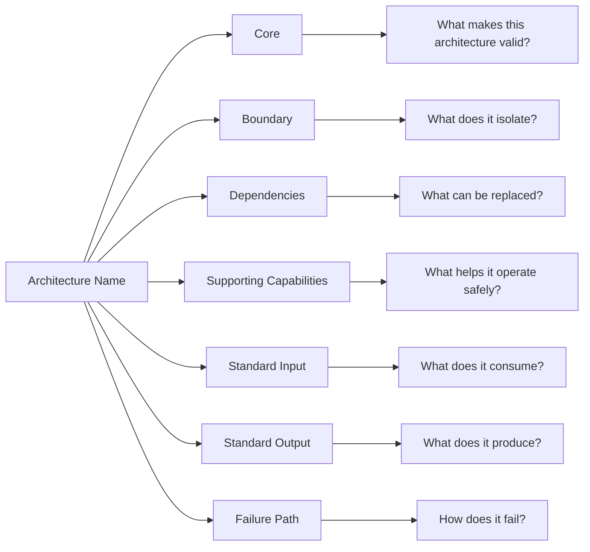
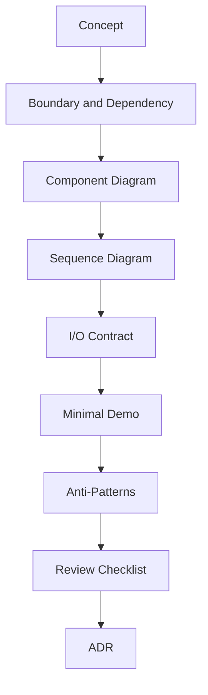

# Architecture Map

> A visual map of how this atlas is organized.

专题首页：[Big Tech Architecture Atlas](README.md)

## Learning Flow

## Architecture Categories

## How To Read Any Architecture

## From Concept To Practice

